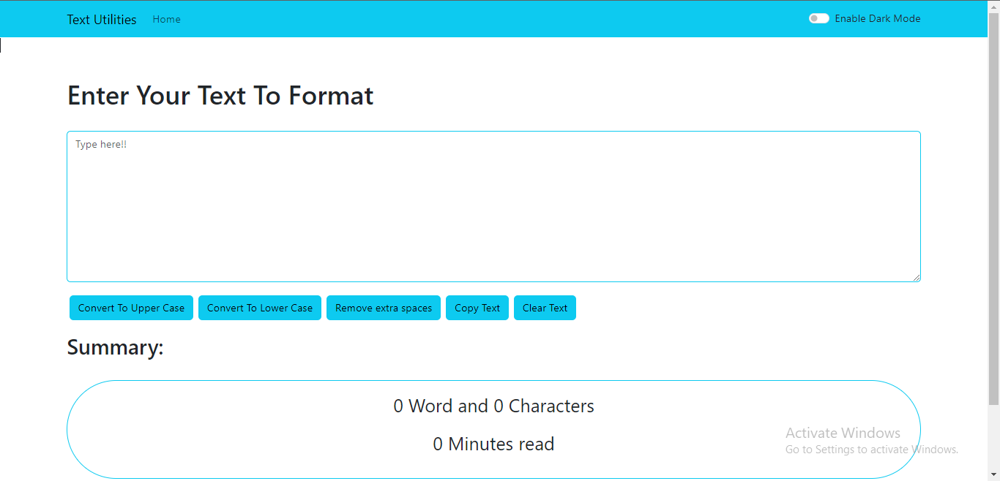
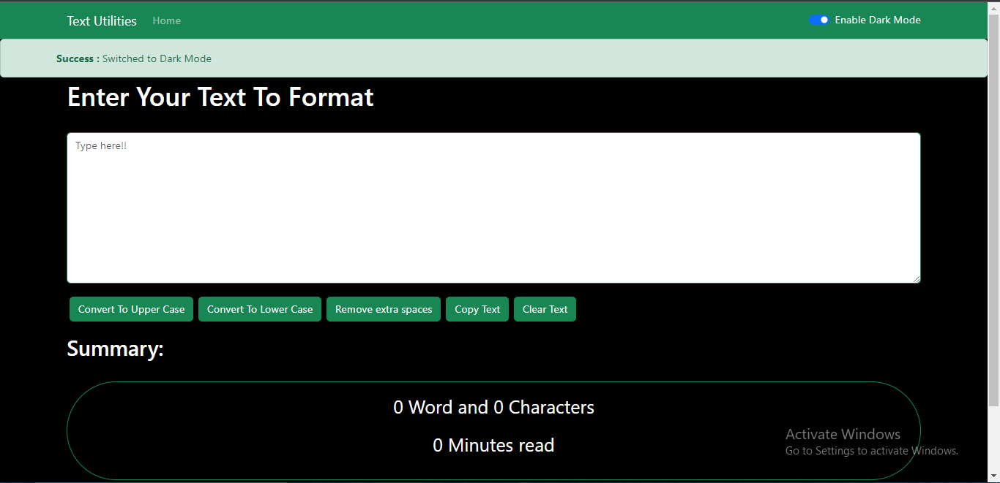
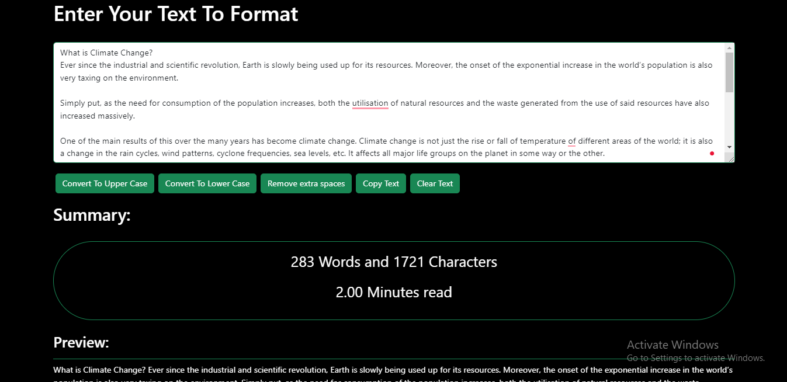

# Text-Formating-App

This app will help you to complete the needs of formating the text like removing spaces, changing it to upper case or vice virsa, copying the text and soon I'll add more new features. 

## First Look

## Dark Mode

### Some Features
- **Upper Case** : Helps you to convert your text in UPPER CASE
- **Lower Case** : Helps you to convert your text in lower case
- **Remove Extra Spaces** : Helps you to remove the Extra Spaces in Your Content and
- **Copy Text** : Helps you to copy your content all at once
- **Key Features**
  - *You can see how many characters and words are there.*
  - *You can also know how much time it will take to read it all*
- **Clear Text** : Also Helps you to clear the text at last
 

-